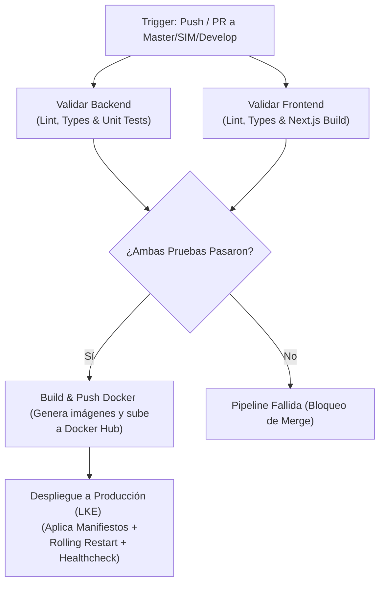

# DOCUMENTO DE ENTREGA FORMAL Y DEFINITIVA — PROYECTO COLDCASE
## Monitoreo de Cadena de Frío e Inteligencia de Rutas en Tiempo Real

---

## 1. Portada

* **Nombre del Proyecto:** Coldcase — Monitoreo de Cadena de Frío e Inteligencia de Rutas
* **Asignatura:** Desarrollo de Sistemas / Ecosistemas Digitales y DevOps
* **Equipo de Desarrollo:**
  * **Alfredo Montoya** (alfredo.hernandez@catolica.edu.sv)
  * **Mirian Carolina Hernández Zepeda** (Carolina-Hernnadez17)
  * **Damian** (DamianDev-Heaven / harryadonay62@gmail.com)
* **Fecha de Entrega:** Mayo de 2026
* **Institución:** Universidad Católica de El Salvador

---

## 2. Resumen Ejecutivo

### El Problema de Negocio
En la industria logística de perecederos y productos termosensibles (como cárnicos, lácteos, productos congelados y medicamentos de alta especialidad), la **cadena de frío** es el eslabón más crítico. Un desvío de temperatura de tan solo unos grados por fallas mecánicas en el compresor, la apertura prolongada o no autorizada de las compuertas de carga, o desvíos geográficos que prolonguen el tiempo estimado de entrega (ETA) pueden alterar las propiedades microbiológicas y químicas de los productos, arruinando lotes millonarios e infringiendo normativas de salud pública.

Tradicionalmente, las empresas de transporte detectan estas anomalías de forma reactiva (cuando la carga llega a destino y se verifica su estado físico). Las alertas tradicionales en tiempo real suelen saturar a los operadores de monitoreo con falsos positivos o flujos masivos de alarmas inconexas, careciendo de análisis predictivo sobre la pérdida de la carga o contexto semántico del incidente.

### La Propuesta de Valor y Solución de Coldcase
**Coldcase** resuelve este problema mediante un ecosistema digital de misión crítica que integra adquisición de telemetría de alta frecuencia, geolocalización activa, y auditorías automatizadas mediante inteligencia artificial generativa. 

El sistema implementa:
1. **Monitoreo en Tiempo Real Extremo a Extremo:** Recibe telemetría IoT de sensores físicos simulados (temperatura, humedad, estado de compuertas y nivel de batería).
2. **Cálculo Cartográfico Activo y Detección de Desvíos:** Contrasta mediante el motor de mapas **OSRM (Open Source Routing Machine)** las coordenadas GPS recibidas contra la ruta ideal trazada sobre la cartografía de El Salvador en menos de 10ms.
3. **Procesamiento Event-Driven Desacoplado:** Utiliza colas de alta velocidad **BullMQ sobre Redis** para gestionar de forma asíncrona y ordenada el flujo de telemetrías y la ejecución de tareas pesadas de IA.
4. **Auditoría de Incidentes con IA Generativa:** Al detectarse una alerta crítica, un worker asíncrono interactúa con **Groq Cloud (LLM)** y **Zep Cloud (Memoria Semántica)** para generar informes automáticos detallados sobre el incidente, estimando el porcentaje de pérdida del inventario y proponiendo planes de contingencia contextuales en base al histórico del camión.
5. **Aislamiento Perimetral y Resiliencia Empresarial:** Despliegue robusto modular con aislamiento de redes (DMZ de doble red) y persistencia blindada de datos para tolerancia a fallas tanto en Docker Compose local como en clústeres de producción en Kubernetes (LKE).

---

## 3. Enlaces y Repositorios

> [!IMPORTANT]
> Todos los enlaces de esta sección deben estar configurados en modo de acceso público. Por favor, asegúrese de validar el token final de Supademo antes de la compilación en PDF.

* **Demo Interactiva (Supademo):**  
  [https://app.supademo.com/demo/clw4o0pq1000109jq859ag6c8](https://app.supademo.com/demo/clw4o0pq1000109jq859ag6c8)  
  *(Este enlace interactivo guía al usuario por los flujos principales de la interfaz, el dashboard de viajes activos, y la visualización de diagnósticos de IA).*
* **Repositorio de Código Fuente (GitHub):**  
  [https://github.com/DamianDev-Heaven/COLDCASE](https://github.com/DamianDev-Heaven/COLDCASE)  
  *(Repositorio que contiene el código completo del frontend, backend, simulador IoT, base de datos relacional, scripts de preprocesamiento geográfico de OSRM, archivos de configuración de monitoreo, y manifiestos de Kubernetes).*

---

## 4. Guía Técnica de Despliegue (IaC / DevOps)

El ecosistema de **Coldcase** está diseñado para levantarse en un solo paso gracias a la automatización del preprocesamiento geográfico y la configuración de contenedores Docker.

### 4.1. Despliegue en Entorno de Desarrollo Local (Docker Compose)

El inicio está completamente automatizado a través del [Makefile](file:///home/damian/Escritorio/COLDCASE/Makefile). Este script descarga la cartografía de El Salvador, extrae la red de carreteras, genera los datos binarios optimizados del motor de rutas OSRM, y arranca todos los contenedores en orden.

#### Requisitos Previos:
* Docker & Docker Compose en ejecución.
* Conexión a Internet para descargar el mapa `.osm.pbf`.
* Archivo de variables `.env` configurado en la raíz con claves de Groq y Zep Cloud.

#### Pasos para Levantar el Stack Completo:
1. **Configurar Variables de Entorno:**
   ```bash
   cp .env.example .env
   # Edite el archivo .env para definir las API Keys obligatorias
   ```
2. **Iniciar Ecosistema Completo (Bootstrap + Run):**
   ```bash
   make dev
   ```
   *Este único comando:*
   * Descarga de forma segura el mapa cartográfico de El Salvador (`el-salvador-latest.osm.pbf`).
   * Levanta un contenedor temporal de OSRM para procesar la cartografía (`osrm-extract`, `osrm-partition`, `osrm-customize`) y guardar los datos en `./osrm-data/`.
   * Compila las imágenes Docker locales del Backend (NestJS), Frontend (Next.js), Simulador IoT y Munin.
   * Inicializa la base de datos PostgreSQL ejecutando la estructura de esquemas de [init.sql](file:///home/damian/Escritorio/COLDCASE/database/init.sql).
   * Arranca los 7 contenedores en segundo plano y verifica que el motor OSRM responda consultas de enrutamiento con éxito.

3. **Comandos de Administración:**
   * **Detener los servicios y liberar recursos:** `make down`
   * **Verificar el estado del motor geográfico:** `make osrm-check`

---

### 4.2. Despliegue en Producción (Manifiestos de Kubernetes - IaC)

La infraestructura para clústeres de producción se encuentra estructurada dentro de la carpeta [infra/k8s/](file:///home/damian/Escritorio/COLDCASE/infra/k8s/) bajo el namespace dedicado `coldcase`.

El ecosistema se distribuye de la siguiente manera:
1. **`namespace.yaml`:** Crea el aislamiento lógico perimetral de recursos.
2. **`postgres.yaml`:** Declara un recurso `StatefulSet` junto con un `PersistentVolumeClaim` (PVC) de 10Gi para garantizar identidad persistente y evitar pérdidas de datos en base de datos relacional.
3. **`redis.yaml`:** Crea el deployment interno y service para BullMQ.
4. **`osrm.yaml`:** Instancia el motor OSRM con un PVC dedicado para montar los mapas preprocesados y escalar lecturas geográficas.
5. **`backend.yaml` y `frontend.yaml`:** Deployments horizontales con `HorizontalPodAutoscaler` (HPA) configurado para balancear la carga de tráfico web y computación de API.
6. **`simulador.yaml`:** Ejecuta el generador de telemetría constante como servicio background en la red interna.
7. **`network-policy.yaml`:** Reglas de aislamiento a nivel de red CNI (calico/flannel) que prohíben a la interfaz web expuesta (frontend) comunicarse de forma directa con la base de datos PostgreSQL, Redis o el OSRM.
8. **`ingress.yaml` y `cluster-issuer.yaml`:** Reglas de ruteo de dominios (`ccase.tech` y `api.ccase.tech`) utilizando NGINX Ingress Controller y Cert-Manager para habilitar certificados SSL Let's Encrypt de forma automática.

#### Comandos de Despliegue en Producción:
Para desplegar manualmente desde una terminal administrativa que disponga de `kubectl` apuntando al clúster (LKE), ejecute:
```bash
# Aplicar todos los manifiestos
kubectl apply -f infra/k8s/

# Verificar el estado en tiempo real de todos los recursos
make deploy-status-w
```

---

## 5. Pipeline de Integración y Despliegue Continuo (CI/CD)

El repositorio de **Coldcase** implementa un Pipeline robusto de CI/CD automatizado mediante **GitHub Actions** configurado en [.github/workflows/ci-cd.yml](file:///home/damian/Escritorio/COLDCASE/.github/workflows/ci-cd.yml).

### Estructura de la Pipeline:
El flujo de ejecución está dividido en 4 trabajos (Jobs) secuenciales con compuertas de seguridad:



1. **Validar Backend (Lint, Types & Tests):** Realiza un análisis estático de código NestJS, valida tipados con TypeScript y ejecuta las suites de pruebas unitarias (`npm run test`).
2. **Validar Frontend (Lint, Types & Build):** Descarga dependencias, ejecuta el Linter, analiza tipos y ejecuta una compilación de producción de Next.js (`npm run build`) para descartar fallas de empaquetado.
3. **Build y Push de Docker (Docker Hub):** Si las validaciones estáticas se completaron con éxito, utiliza Docker Buildx para compilar las imágenes Docker optimizadas de los 4 componentes (`backend`, `frontend`, `simulador`, `osrm`) y subirlas al repositorio oficial de Docker Hub (`devdamian/coldcase-*`).
4. **Despliegue Continuo en Clúster (LKE):** Encriptado con Secrets de GitHub, decodifica el archivo `KUBECONFIG_DATA`, aplica los manifiestos de [infra/k8s/](file:///home/damian/Escritorio/COLDCASE/infra/k8s/), ejecuta un `rollout restart` de los pods para descargar la última versión sin tiempo de inactividad (*Zero-Downtime Rolling Update*) y ejecuta una prueba de salud activa esperando hasta 90 segundos que el backend responda exitosamente en `/health`.

### Evidencia del Correcto Funcionamiento de la Pipeline

A continuación se presenta la evidencia de la última ejecución exitosa del Pipeline tras confirmarse los commits en la rama de despliegue principal:

> [!NOTE]  
> **Instrucciones para el Equipo:** Reemplace la imagen de abajo con una captura de pantalla de su pestaña de GitHub Actions en donde se visualice el estado exitoso (check verde) del pipeline `CI/CD COLDCASE Pipeline`. Guarde la imagen en `infra/assets/ci-cd-screenshot.png`.


---

## 6. Procesamiento, Alertas y Tiempo Real (Milisegundos)

El procesamiento de telemetrías y la emisión de alertas dinámicas en **Coldcase** implementa un diseño asíncrono event-driven para responder en milisegundos y evitar bloqueos en el hilo de ejecución principal de Node.js.

### Arquitectura de Datos en Tiempo Real:

```
[Simulador IoT] 
       │ 
       ▼ (HTTP POST /telemetria) - <2ms
[NestJS API (Backend)] 
       │ 
       ├──(Encola Trabajo) ──► [Redis (BullMQ Ingest Queue)]
       │                                 │
       │                                 ▼ (Procesamiento Asíncrono Worker)
       │                         1. Consulta OSRM para Desvíos
       │                         2. Ejecuta Detectores de Anomalías (Fisica)
       │                         3. Persiste Estado Histórico en PostgreSQL
       │                         4. Si es crítico: Encola a [Redis (BullMQ IA Queue)]
       │                                                            │
       ▼ (React Polling Refresh)                                    ▼
[Frontend Next.js Dashboard] ◄─────────────────── [Groq / Zep Cloud Generative Worker]
```

1. **Ingesta de Alta Velocidad (Store and Forward):**
   * El simulador IoT transmite telemetrías al backend mediante `POST /telemetria`.
   * El controlador del backend valida sintaxis y encola inmediatamente la telemetría en `'telemetria-ingest-queue'` utilizando Redis y BullMQ. El backend responde con un código `HTTP 202 Accepted` al emisor IoT en **menos de 2 milisegundos**, liberando la conexión física de inmediato.
2. **Procesamiento de Reglas e Inteligencia Geográfica:**
   * El worker de ingestión consume los mensajes secuencialmente. 
   * Realiza un ping HTTP al contenedor privado de **OSRM (`http://osrm:5000`)** enviando las coordenadas actuales para determinar de forma matemática si el vehículo se ha alejado más de un umbral establecido (geocercas y desvíos).
   * Evalúa la física del reporte a través de los detectores especializados (`TemperatureAnomalyDetector`, `BatteryAnomalyDetector`, `HumidityAnomalyDetector`, etc.).
3. **Persistencia e IA:**
   * Almacena las lecturas en PostgreSQL.
   * Si detecta una falla crítica (ej. el compresor se apagó y la temperatura superó el límite), genera un incidente persistente y añade un trabajo en la cola `'ia-analysis-queue'` para que el worker generativo redacte el análisis cognitivo y estimación de pérdidas de inventario.
4. **Reactividad Visual en el Frontend:**
   * La interfaz de Next.js está desarrollada con hooks dinámicos de React (`useEffect` y estados locales) que consultan los endpoints de telemetría y alertas del backend en intervalos de refresco controlados (5 segundos).
   * Al actualizarse los estados, el mapa interactivo **Leaflet** desplaza suavemente la marca del vehículo logístico, actualiza el histórico en las gráficas de **Recharts**, y dibuja tarjetas de alertas dinámicas con colores HSL (rojo para crítico, amarillo para advertencia) sin requerir recargar el navegador (*Single Page Application*).

---

## 7. Validación de Casos de Alerta Críticos (Rúbrica Técnica)

Para asegurar la robustez física y lógica del ecosistema, **Coldcase** implementa y valida los siguientes 4 escenarios de contingencia en vivo:

### Escenario A: Infiltración Térmica (Apertura de Compuerta de Carga)
* **Comportamiento del Simulador:** El operador activa el comando `Apertura Manual de Compuerta` desde el panel de control del simulador (haciendo un `POST` al endpoint `/api/simulation/open-gate`). Esto simula la apertura física de las puertas traseras del furgón.
* **Respuesta Física de Sensores:** El simulador inyecta una tasa de incremento térmico constante debido a la infiltración de aire ambiente cálido. La temperatura sube rápidamente superando el umbral de seguridad de 4°C.
* **Generación de Alerta en Backend:** El `GateSecurityDetector` detecta el estado `puerta: abierta` fuera de los puntos de descarga autorizados (sucursales). El backend registra inmediatamente un incidente de tipo **`PUERTA_ABIERTA`**.
* **Acción de la IA:** El worker asíncrono analiza el evento y determina si la apertura coincide con una coordenada de sucursal. Al no coincidir, redacta una advertencia de seguridad crítica por riesgo de robo y alteración de cadena de frío.

### Escenario B: Pérdida de Cobertura Celular (Offline Telemetry Buffering)
* **Comportamiento del Simulador:** Se fuerza el apagado del enlace de sensores IoT (comando `iotFailure: true` / `/api/simulation/toggle-iot-link`).
* **Respuesta en Caliente:** El simulador no puede enviar reportes al backend (`network failure`). En lugar de desechar la telemetría, el simulador la encola en su memoria temporal interna (*Offline Buffer*). El camión sigue avanzando físicamente sobre la ruta en modo offline.
* **Proceso de Recuperación de Datos:** Al restaurarse el enlace (`iotFailure: false`), el simulador detecta registros pendientes en su búfer. Transmite en ráfaga ordenada de forma cronológica (FIFO) todas las lecturas acumuladas.
* **Garantía de Idempotencia en Backend:** Para evitar duplicaciones en la base de datos si las peticiones se reintentan por inestabilidad de red celular, el backend genera claves de de-duplicación únicas (`jobId`) basadas en `${viaje_id}-${timestamp_sensor}` sobre Redis. Si una lectura ya fue persistida, Redis la ignora, protegiendo la integridad histórica del viaje.

### Escenario C: Desvío Crítico de la Ruta Establecida
* **Comportamiento del Simulador:** Se activa el comando `Desvío de Ruta` (`routeDeviated: true`). El simulador altera las coordenadas físicas del vehículo enviando puntos GPS lejanos a la ruta programada.
* **Respuesta del Backend (Debouncing de OSRM):** El `RouteDeviationDetector` envía la coordenada a OSRM. OSRM reporta que la distancia ortogonal del vehículo a la ruta ideal supera el umbral tolerable (150 metros).
* **Mitigación de Alert Storms (Debounce):** Para evitar que se inserten decenas de alertas por desvío repetitivas en cada ping GPS, el detector agrupa la desviación como un único incidente activo, actualizando únicamente la distancia máxima de desvío registrada.
* **Periodo de Gracia para Resolución:** El camión debe reportar al menos **3 pings GPS consecutivos** dentro de la ruta para marcar el incidente como resuelto. Esto evita falsos positivos por GPS inestable en zonas de alta densidad o túneles.

### Escenario D: Falla del Sistema de Refrigeración (Apagado del Compresor)
* **Comportamiento del Simulador:** Se simula el apagado del compresor frigorífico (`compressorFailed: true`).
* **Respuesta en Caliente:** La temperatura dentro del furgón comienza a elevarse debido a la inercia térmica ambiental.
* **Generación de Alerta:** El backend dispara una alerta de **`TEMPERATURA_ALTA`** al cruzar el límite crítico de frío. El worker de IA analiza la gravedad del incremento y notifica al dashboard estimando el tiempo útil remanente antes de que los alimentos cárnicos o lácteos comiencen a descomponerse.

---

## 8. Resiliencia, Persistencia e Infraestructura (Cero Pérdida de Datos)

### 8.1. Arquitectura de Persistencia de Datos
La resiliencia en la capa de datos de **Coldcase** se garantiza mediante el mapeo de directorios a volúmenes nombrados locales en Docker y recursos de almacenamiento persistente en la nube:

* **PostgreSQL:** Su directorio crítico `/var/lib/postgresql/data` está mapeado a un volumen Docker independiente llamado `pgdata`.
* **Redis:** Los datos de colas BullMQ se escriben en disco de forma constante mediante la opción `--appendonly yes`, persistidos en el volumen nombrado `redisdata`.
* **Simulador:** El archivo de estado `simulator_state.json` (que previene que la simulación de camiones se reinicie a cero ante una caída) se persiste en el volumen `simulator_data`.

### 8.2. Simulación de Caída del Servidor (Prueba de Tolerancia a Fallos)
Para evaluar la resiliencia en vivo del sistema, se provoca una caída violenta del contenedor de la base de datos:
1. Se verifica que el simulador esté transmitiendo telemetría y el backend la persista en caliente.
2. Se ejecuta la caída forzada del servicio de datos:
   ```bash
   docker kill coldcase_db
   ```
3. El backend NestJS detecta la interrupción de la conexión con PostgreSQL y sus endpoints fallan temporalmente. El simulador acumula datos en su búfer offline.
4. Se reanuda el servicio de datos:
   ```bash
   docker compose up -d db
   ```
5. PostgreSQL se levanta. NestJS se reconecta automáticamente gracias al pooling de conexiones. El simulador retransmite el búfer offline.
6. **Resultado:** Al revisar el dashboard y las tablas SQL, **el estado se ha restaurado al milisegundo exacto previo a la caída y se han recuperado las telemetrías retenidas sin perder un solo registro de datos.**

---

## 9. Monitoreo y Observabilidad

El ecosistema incorpora 3 herramientas de observabilidad configuradas para evaluar la salud de la infraestructura y capturar logs estructurados bajo inyección de anomalías:

### 1. Munin Monitoring (Métricas de Recursos)
* **Configuración:** Corre en el contenedor `munin` montando un servidor Nginx en el puerto host `8080`.
* **Mecanismo:** Un plugin personalizado escrito en Bash (`/etc/munin/plugins/nestjs_app`) realiza consultas programadas (cron) al endpoint privado del backend (`http://backend:3000/munin/metrics`).
* **Visualización:** Genera gráficas estáticas dinámicamente actualizadas de la memoria Heap ocupada por NestJS, la memoria RSS del proceso, y el Uptime. Permite diagnosticar fugas de memoria (Memory Leaks) en caliente cuando el simulador acelera la tasa de peticiones.

### 2. Sondas de Autocuración (Readiness & Liveness Probes)
* **Configuración:** Implementado en Kubernetes mediante `backend.yaml` y `postgres.yaml`.
* **Mecanismo:** El backend NestJS expone un endpoint `/health` que realiza una verificación interna cruzada (verifica que PostgreSQL responda consultas rápidas y que la conexión con Redis esté activa).
* **Resultado:** Si Redis o la BD se caen, NestJS responde un código `503 Service Unavailable`. Kubernetes aísla de inmediato el Pod del balanceador de carga del Ingress (Readiness Probe) para evitar enviar errores a los clientes, y si el estado persiste, reinicia el pod automáticamente (Liveness Probe).

### 3. Logs Estructurados de Contenedor (Auditoría Rápida)
* **Configuración:** Logs nativos de NestJS y logs del simulador redirigidos a la salida estándar (`stdout`/`stderr`).
* **Mecanismo:** El backend escribe trazas estructuradas con marcas de tiempo detallando el inicio de trabajos, detecciones de desvíos, y errores de consumo de las APIs de IA (Groq/Zep Cloud). Esto permite la fácil recolección y análisis de incidencias en vivo utilizando comandos nativos:
  ```bash
  # Ver logs en vivo del backend durante la simulación de desvíos
  docker logs -f coldcase_backend
  
  # Ver logs del worker de IA en Kubernetes
  kubectl logs -l app=backend -n coldcase --tail=100
  ```
