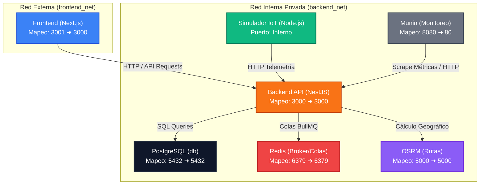

# Coldcase — Monitoreo de Cadena de Frío e Inteligencia de Rutas

[](https://nestjs.com/)
[](https://nextjs.org/)
[](https://www.docker.com/)
[](https://kubernetes.io/)
[](https://redis.io/)
[](https://www.postgresql.org/)
[](https://groq.com/)

Sistema de misión crítica para la supervisión, geolocalización y auditoría inteligente en tiempo real de transporte logístico refrigerado (cárnicos, lácteos, congelados y medicamentos). El ecosistema integra adquisición de telemetría de alta frecuencia, control geográfico de desvíos, alertas automáticas, simulación física de hardware y auditoría de incidentes mediante procesamiento asíncrono e inteligencia artificial generativa.

---

## 1. Topología y Arquitectura del Sistema

El sistema implementa un **patrón de doble red aislada (`frontend_net` y `backend_net`)** para simular seguridad perimetral de grado empresarial (DMZ Interna):

> [!NOTE]  
> Para un desglose técnico exhaustivo de los flujos de datos, mapas de volúmenes, asignación de puertos, políticas de aislamiento de red y su correspondencia con manifiestos de Kubernetes, consulta la **[Guía Detallada de Topología de Contenedores](TOPOLOGIA_CONTENEDORES.md)**.

<!-- 
OPCIÓN DE IMAGEN PERSONALIZADA:
Si prefieres diseñar tu propio diagrama en Figma, draw.io, Excalidraw o Miro y subir la imagen:
1. Exporta tu diseño como PNG o SVG y guárdalo en la ruta: 'infra/assets/topologia.png'
2. Reemplaza el bloque ```mermaid de abajo por la siguiente línea:


-->



### Componentes y Puertos de la Infraestructura

| Servicio | Tecnología | Puerto Local | Red de Aislamiento | Descripción |
| :--- | :--- | :--- | :--- | :--- |
| **`frontend`** | Next.js (React / Leaflet) | `3001` | `frontend_net` | Portal del operador, dashboard en tiempo real, mapas dinámicos e informes de IA. |
| **`backend`** | NestJS (TypeScript / PG) | `3000` | `frontend_net` & `backend_net` | API Gateway, autenticación JWT, ingestión event-driven y orquestador de IA. |
| **`simulador`**| Node.js (Física / HTTP) | `Interno` | `backend_net` | Simulador IoT de física de camiones (rutas de El Salvador, temperatura, puertas). |
| **`osrm`** | Open Source Routing Machine | `5000` | `backend_net` | Motor cartográfico y de cálculo geográfico para detección de desvíos de ruta. |
| **`redis`** | Redis (Alpine) | `6379` | `backend_net` | Broker de mensajería y persistencia de colas BullMQ para ingestión y workers de IA. |
| **`db`** | PostgreSQL 15 | `5432` | `backend_net` | Base de datos relacional para telemetría histórica, viajes, incidentes e inventarios. |
| **`munin`** | Munin Monitoring (Nginx) | `8080` | `backend_net` | Panel de monitoreo de métricas nativas del proceso (Heap Memory, RSS, uptime). |

---

## 2. Configuración del Entorno de Desarrollo

### Requisitos Previos
* **Docker y Docker Compose** (Instalado y corriendo)
* **Node.js** (v18 o superior para ejecución de scripts locales)
* **API Keys** de **Zep Cloud** y **Groq Cloud** (Requeridas para la memoria semántica de incidentes y las auditorías de IA)

### Configuración de Variables de Entorno

1. Copia el archivo de plantilla a tu entorno local:
   ```bash
   cp .env.example .env
   ```
2. Define los siguientes parámetros obligatorios en tu archivo `.env`:
   * **Persistencia PostgreSQL**: `DB_USER`, `DB_PASSWORD`, `DB_NAME` (credenciales de la base de datos).
   * **Sesiones Seguras**: `JWT_SECRET` (clave de firmado para tokens JWT).
   * **Servicios de Inteligencia Artificial**:
     * `LLM_API_KEY`: API Key de Groq.
     * `ZEP_API_URL`: URL del endpoint de Zep Cloud (e.g. `https://api.getzep.com`).
     * `ZEP_API_KEY`: API Key de Zep Cloud.

---

## 3. Puesta en Marcha en Local

El flujo de inicio se automatiza a través de un `Makefile` que descarga los mapas geográficos de El Salvador requeridos por OSRM, preprocesa la cartografía y levanta todo el ecosistema de contenedores en la secuencia de dependencias correcta.

### Comandos de Ejecución

* **Inicializar y arrancar todo el stack (Recomendado)**:
  ```bash
  make dev
  ```
  *Este comando descarga la cartografía de El Salvador, preprocesa los archivos de OSRM (guardándolos en `osrm-data/`), compila las imágenes de Docker locales y arranca los contenedores.*

* **Descargar y preparar mapas manualmente**:
  ```bash
  make bootstrap
  ```

* **Levantar los servicios sin reconstruir mapas**:
  ```bash
  make up
  ```

* **Detener todos los servicios y liberar recursos**:
  ```bash
  make down
  ```

* **Verificar la salud del motor geográfico OSRM**:
  ```bash
  make osrm-check
  ```

---

## 4. Despliegue en Kubernetes (Producción)

Los manifiestos y políticas de infraestructura para el despliegue de producción están organizados en `infra/k8s/` bajo el namespace aislado `coldcase`.

### Estructura de Manifiestos (infra/k8s/)

* `namespace.yaml`: Aislamiento perimetral bajo el espacio de nombres `coldcase`.
* `postgres.yaml`: Configuración persistente de PostgreSQL mediante `StatefulSet` y `PersistentVolumeClaim` (PVC).
* `redis.yaml` y `osrm.yaml`: Deployments internos de soporte asíncrono y de ruteo geográfico.
* `backend.yaml` y `frontend.yaml`: Deployments de los microservicios centrales con escalado horizontal automático (`HorizontalPodAutoscaler` en base a uso de CPU/RAM).
* `simulador.yaml`: Simulador IoT ejecutándose en segundo plano dentro del clúster de forma constante.
* `network-policy.yaml`: Políticas de red estrictas que impiden físicamente a los pods expuestos al exterior (frontend) conversar con las bases de datos o brokers internos.
* `ingress.yaml` y `cluster-issuer.yaml`: Enrutamiento HTTPS perimetral balanceado y renovación automática de certificados SSL vía Cert-Manager.

### Scripts de Operaciones y Monitoreo SRE

La raíz del proyecto incluye atajos en el `Makefile` para interactuar con la infraestructura usando la versión autocontenida de `kubectl`:

* **Estado General de Infraestructura**:
  ```bash
  make deploy-status
  ```
  *Muestra una vista interactiva y depurada del estado de los Pods, Deployments, StatefulSets, rutas de Ingress y el estado de los certificados SSL.*

* **Monitoreo en Tiempo Real**:
  ```bash
  make deploy-status-w
  ```
  *Mantiene una consola de monitoreo activa con actualizaciones al segundo del estado de los recursos de Kubernetes.*

* **Despliegue e Integración Continua Manual**:
  ```bash
  ./scripts/deploy-manual.sh <servicio>
  ```
  *Permite compilar, etiquetar, subir a Docker Hub (`docker push`) y aplicar actualizaciones en vivo de microservicios específicos (e.g. `backend`, `frontend`, `simulador`, `all`) de forma guiada.*

---

## 5. Calidad, Pruebas y Observabilidad

### Healthcheck Multivariable (Autocuración)
El backend implementa un endpoint de salud avanzado en `/health` que realiza una consulta rápida a PostgreSQL (`SELECT 1`) y verifica el estado de la conexión con el clúster de Redis (BullMQ). Este endpoint se mapea a los **Readiness Probes** y **Liveness Probes** de Kubernetes para aislar y reiniciar pods de NestJS de forma automática en caso de degradación de las dependencias.

### Pruebas de Calidad Locales
Cada microservicio cuenta con validación de sintaxis y tipado estático integrado en el pipeline de CI/CD:

```bash
# Ejecutar lint y pruebas unitarias en el Backend
cd backend && npm run lint && npm run test

# Ejecutar lint y chequeo de tipos estáticos en el Frontend
cd frontend && npm run lint && npx tsc --noEmit
```

---

## 6. Patrones de Arquitectura y Resiliencia Implementados

Se han incorporado mejoras estructurales para robustecer la asincronía, el rendimiento de red y la tolerancia a fallos del sistema en producción:

### 1. Desacoplamiento de Ingesta Asíncrona (BullMQ & Redis)
* **Problema Original:** El procesamiento síncrono de telemetrías hacía consultas cartográficas de red a OSRM y base de datos en caliente, arriesgando el bloqueo del Event Loop de Node.js bajo ráfagas concurrentes de múltiples vehículos.
* **Solución:** El endpoint `POST /telemetria` ahora valida rápidamente el DTO y encola la telemetría en `'telemetria-ingest-queue'`, retornando un código **`HTTP 202 Accepted`** en `<2ms`. Un worker asíncrono con `concurrency: 1` consume la cola de forma aislada, garantizando procesamiento en orden cronológico estricto de ráfagas acumuladas (*Store and Forward*).

### 2. Idempotencia y De-duplicación a Nivel de Ingesta
* **Problema Original:** Los reintentos automáticos del hardware de transporte por fallas de cobertura celular saturaban la base de datos con telemetrías duplicadas.
* **Solución:** Cada mensaje encolado genera una clave de de-duplicación única (`jobId`) basada en `${viaje_id}-${timestamp_sensor}`. Redis aborta la inserción de trabajos repetidos encolados en la misma marca de tiempo, garantizando la de-duplicación antes de tocar la persistencia relacional en PostgreSQL.

### 3. Debouncing de Desvíos Geográficos y Telemetry Smoothing (OSRM)
* **Problema Original:** Las alertas por desvíos menores causaban inyecciones repetitivas de incidentes paralelos e inundaban de llamadas redundantes a las APIs de IA (saturando tasas de tokens).
* **Solución:** Refactorizamos `RouteDeviationDetector` para implementar un patrón de ciclo de vida controlado:
  * Agrupa las anomalías de desvío consecutivas bajo un único incidente activo y registra eventos de actualización de pico en metros (`PICO_ACTUALIZADO`).
  * Requiere un período de gracia de **3 pings consecutivos** dentro de la ruta para marcar el desvío como resuelto.
  * Solo al consolidarse la resolución se encola el análisis de IA de forma asíncrona, optimizando costes de API e incrementando la precisión del LLM.

### 4. Resiliencia de Workers IA & Dead Letter Queue (DLQ)
* **Problema Original:** Un fallo en la API externa de Zep Cloud o Groq abortaba el flujo general o creaba reintentos infinitos que bloqueaban la cola de procesamiento.
* **Solución:** Las tareas delegadas a la cola de IA (`ia-analysis-queue`) implementan reintentos máximos acotados (5) y una política de **Backoff Exponencial** de `5000ms`. Si la tarea falla de forma persistente, se retiene en Redis (`removeOnFail: false`) actuando como una **Dead Letter Queue (DLQ)** nativa para auditoría e inspección de errores, aislando cargas corruptas.

### 5. Healthcheck Multivariable y Autocuración Proactiva
* **Problema Original:** El healthcheck tradicional solo consultaba PostgreSQL, exponiendo al clúster de Kubernetes a enviar tráfico a pods del backend que no tenían comunicación con Redis (causando fallos silenciosos en el procesamiento de BullMQ).
* **Solución:** El endpoint de salud en `/health` de NestJS ejecuta consultas paralelas a PostgreSQL (`SELECT 1`) y verifica el estado vivo de la cola de BullMQ (`isPaused()` hacia Redis). Si cualquiera de los dos sistemas falla, responde un `503 Service Unavailable`, haciendo que Kubernetes aísle proactivamente el Pod del tráfico real y lo reinicie de forma autónoma.