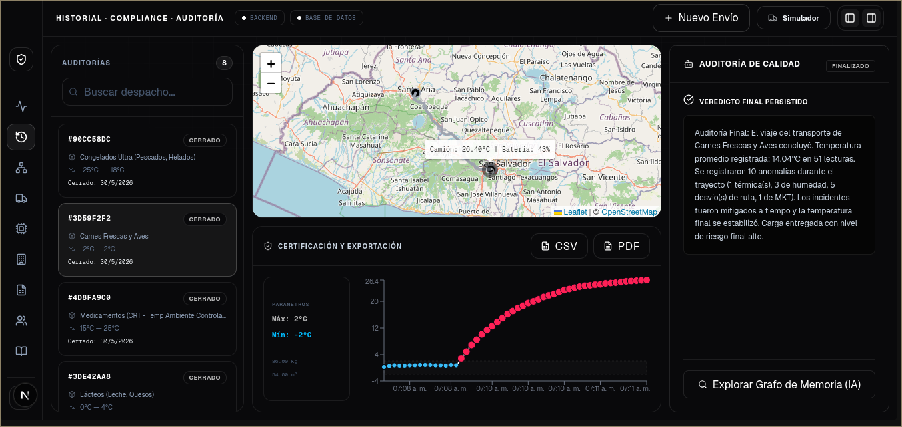
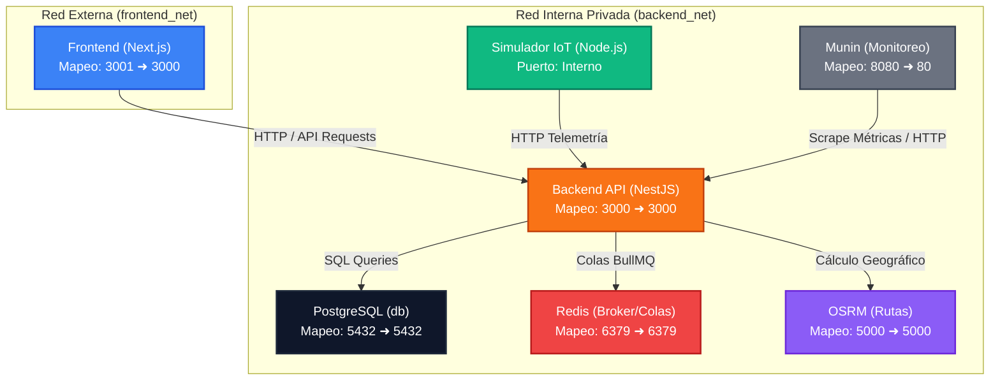
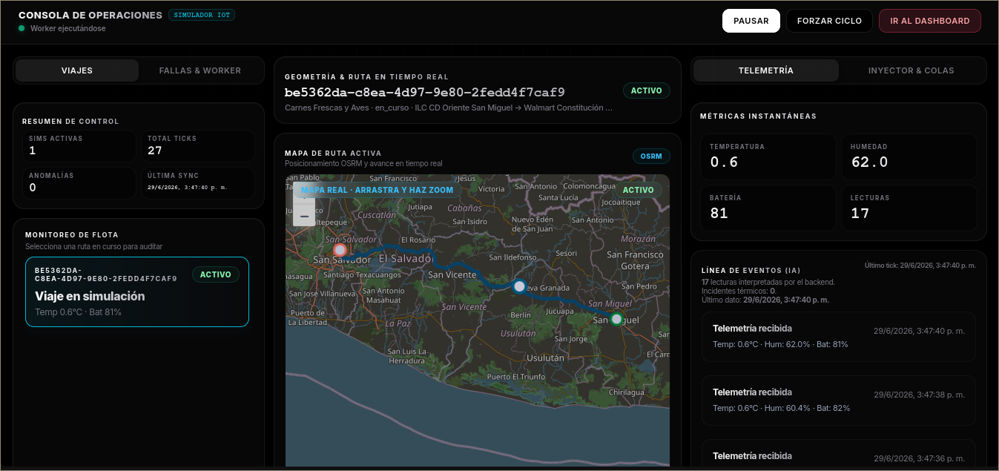
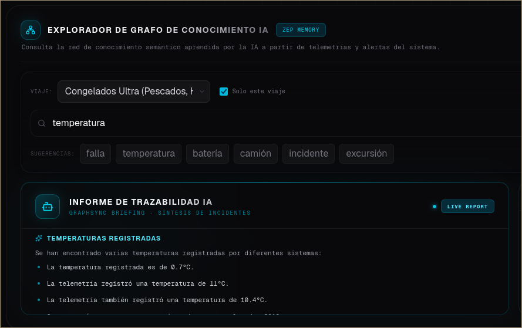

# Coldcase — Monitoreo de Cadena de Frío e Inteligencia de Rutas

[](https://nestjs.com/)
[](https://nextjs.org/)
[](https://www.docker.com/)
[](https://kubernetes.io/)
[](https://redis.io/)
[](https://www.postgresql.org/)
[](https://groq.com/)

Sistema de misión crítica para la supervisión, geolocalización y auditoría inteligente en tiempo real de transporte logístico refrigerado (cárnicos, lácteos, congelados y medicamentos). El ecosistema integra adquisición de telemetría de alta frecuencia, control geográfico de desvíos, alertas automáticas, simulación física de hardware y auditoría de incidentes mediante procesamiento asíncrono e inteligencia artificial generativa.



---

## 1. Topología y Arquitectura del Sistema

El sistema implementa un **patrón de doble red aislada (`frontend_net` y `backend_net`)** para simular seguridad perimetral de grado empresarial (DMZ Interna):

> [!NOTE]  
> Para un desglose técnico exhaustivo de los flujos de datos, mapas de volúmenes, asignación de puertos, políticas de aislamiento de red y su correspondencia con manifiestos de Kubernetes, consulta la **[Guía Detallada de Topología de Contenedores](TOPOLOGIA_CONTENEDORES.md)**.


```mermaid
graph TD
    %% Definición de estilos
    classDef frontend fill:#3b82f6,stroke:#1d4ed8,stroke-width:2px,color:#fff;
    classDef backend fill:#f97316,stroke:#c2410c,stroke-width:2px,color:#fff;
    classDef database fill:#0f172a,stroke:#1e293b,stroke-width:2px,color:#fff;
    classDef queue fill:#ef4444,stroke:#b91c1c,stroke-width:2px,color:#fff;
    classDef geo fill:#8b5cf6,stroke:#6d28d9,stroke-width:2px,color:#fff;
    classDef sim fill:#10b981,stroke:#047857,stroke-width:2px,color:#fff;
    classDef monitor fill:#6b7280,stroke:#374151,stroke-width:2px,color:#fff;

    %% Nodos
    A["Frontend (Next.js)<br/>Mapeo: 3001 ➜ 3000"]:::frontend
    B["Backend API (NestJS)<br/>Mapeo: 3000 ➜ 3000"]:::backend
    C["PostgreSQL (db)<br/>Mapeo: 5432 ➜ 5432"]:::database
    D["Redis (Broker/Colas)<br/>Mapeo: 6379 ➜ 6379"]:::queue
    E["OSRM (Rutas)<br/>Mapeo: 5000 ➜ 5000"]:::geo
    F["Simulador IoT (Node.js)<br/>Puerto: Interno"]:::sim
    G["Munin (Monitoreo)<br/>Mapeo: 8080 ➜ 80"]:::monitor

    %% Redes
    subgraph frontend_net ["Red Externa (frontend_net)"]
        A
    end

    subgraph backend_net ["Red Interna Privada (backend_net)"]
        B
        C
        D
        E
        F
        G
    end

    %% Relaciones
    A -->|HTTP / API Requests| B
    B -->|SQL Queries| C
    B -->|Colas BullMQ| D
    B -->|Cálculo Geográfico| E
    F -->|HTTP Telemetría| B
    G -->|Scrape Métricas / HTTP| B
```

### Componentes y Puertos de la Infraestructura

| Servicio | Tecnología | Puerto Local | Red de Aislamiento | Descripción |
| :--- | :--- | :--- | :--- | :--- |
| **`frontend`** | Next.js (React / Leaflet) | `3001` | `frontend_net` | Portal del operador, dashboard en tiempo real, mapas dinámicos e informes de IA. |
| **`backend`** | NestJS (TypeScript / PG) | `3000` | `frontend_net` & `backend_net` | API Gateway, autenticación JWT, ingestión event-driven y orquestador de IA. |
| **`simulador`**| Node.js (Física / HTTP) | `Interno` | `backend_net` | Simulador IoT de física de camiones (rutas de El Salvador, temperatura, puertas). |
| **`osrm`** | Open Source Routing Machine | `5000` | `backend_net` | Motor cartográfico y de cálculo geográfico para detección de desvíos de ruta. |
| **`redis`** | Redis (Alpine) | `6379` | `backend_net` | Broker de mensajería y persistencia de colas BullMQ para ingestión y workers de IA. |
| **`db`** | PostgreSQL 15 | `5432` | `backend_net` | Base de datos relacional para telemetría histórica, viajes, incidentes e inventarios. |
| **`munin`** | Munin Monitoring (Nginx) | `8080` | `backend_net` | Panel de monitoreo de métricas nativas del proceso (Heap Memory, RSS, uptime). |



---

## 2. Configuración del Entorno de Desarrollo

### Requisitos Previos
* **Docker y Docker Compose** (Instalado y corriendo)
* **Node.js** (v18 o superior para ejecución de scripts locales)
* **API Keys** de **Zep Cloud** y **Groq Cloud** (Requeridas para la memoria semántica de incidentes y las auditorías de IA)

### Configuración de Variables de Entorno

1. Copia el archivo de plantilla a tu entorno local:
   ```bash
   cp .env.example .env
   ```
2. Define los siguientes parámetros obligatorios en tu archivo `.env`:
   * **Persistencia PostgreSQL**: `DB_USER`, `DB_PASSWORD`, `DB_NAME` (credenciales de la base de datos).
   * **Sesiones Seguras**: `JWT_SECRET` (clave de firmado para tokens JWT).
   * **Servicios de Inteligencia Artificial**:
     * `LLM_API_KEY`: API Key de Groq.
     * `ZEP_API_URL`: URL del endpoint de Zep Cloud (e.g. `https://api.getzep.com`).
     * `ZEP_API_KEY`: API Key de Zep Cloud.

---

## 3. Puesta en Marcha en Local

El flujo de inicio se automatiza a través de un `Makefile` que descarga los mapas geográficos de El Salvador requeridos por OSRM, preprocesa la cartografía y levanta todo el ecosistema de contenedores en la secuencia de dependencias correcta.

### Comandos de Ejecución

* **Inicializar y arrancar todo el stack (Recomendado)**:
  ```bash
  make dev
  ```
  *Este comando descarga la cartografía de El Salvador, preprocesa los archivos de OSRM (guardándolos en `osrm-data/`), compila las imágenes de Docker locales y arranca los contenedores.*

* **Descargar y preparar mapas manualmente**:
  ```bash
  make bootstrap
  ```

* **Levantar los servicios sin reconstruir mapas**:
  ```bash
  make up
  ```

* **Detener todos los servicios y liberar recursos**:
  ```bash
  make down
  ```

* **Verificar la salud del motor geográfico OSRM**:
  ```bash
  make osrm-check
  ```

---

## 4. Despliegue en Kubernetes (Producción)

Los manifiestos y políticas de infraestructura para el despliegue de producción están organizados en `infra/k8s/` bajo el namespace aislado `coldcase`.

### Estructura de Manifiestos (infra/k8s/)

* `namespace.yaml`: Aislamiento perimetral bajo el espacio de nombres `coldcase`.
* `postgres.yaml`: Configuración persistente de PostgreSQL mediante `StatefulSet` y `PersistentVolumeClaim` (PVC).
* `redis.yaml` y `osrm.yaml`: Deployments internos de soporte asíncrono y de ruteo geográfico.
* `backend.yaml` y `frontend.yaml`: Deployments de los microservicios centrales con escalado horizontal automático (`HorizontalPodAutoscaler` en base a uso de CPU/RAM).
* `simulador.yaml`: Simulador IoT ejecutándose en segundo plano dentro del clúster de forma constante.
* `network-policy.yaml`: Políticas de red estrictas que impiden físicamente a los pods expuestos al exterior (frontend) conversar con las bases de datos o brokers internos.
* `ingress.yaml` y `cluster-issuer.yaml`: Enrutamiento HTTPS perimetral balanceado y renovación automática de certificados SSL vía Cert-Manager.

### Scripts de Operaciones y Monitoreo SRE

La raíz del proyecto incluye atajos en el `Makefile` para interactuar con la infraestructura usando la versión autocontenida de `kubectl`:

* **Estado General de Infraestructura**:
  ```bash
  make deploy-status
  ```
  *Muestra una vista interactiva y depurada del estado de los Pods, Deployments, StatefulSets, rutas de Ingress y el estado de los certificados SSL.*

* **Monitoreo en Tiempo Real**:
  ```bash
  make deploy-status-w
  ```
  *Mantiene una consola de monitoreo activa con actualizaciones al segundo del estado de los recursos de Kubernetes.*

* **Despliegue e Integración Continua Manual**:
  ```bash
  ./scripts/deploy-manual.sh <servicio>
  ```
  *Permite compilar, etiquetar, subir a Docker Hub (`docker push`) y aplicar actualizaciones en vivo de microservicios específicos (e.g. `backend`, `frontend`, `simulador`, `all`) de forma guiada.*

---

## 5. Calidad, Pruebas y Observabilidad

### Healthcheck Multivariable (Autocuración)
El backend implementa un endpoint de salud avanzado en `/health` que realiza una consulta rápida a PostgreSQL (`SELECT 1`) y verifica el estado de la conexión con el clúster de Redis (BullMQ). Este endpoint se mapea a los **Readiness Probes** y **Liveness Probes** de Kubernetes para aislar y reiniciar pods de NestJS de forma automática en caso de degradación de las dependencias.

### Pruebas de Calidad Locales
Cada microservicio cuenta con validación de sintaxis y tipado estático integrado en el pipeline de CI/CD:

```bash
# Ejecutar lint y pruebas unitarias en el Backend
cd backend && npm run lint && npm run test

# Ejecutar lint y chequeo de tipos estáticos en el Frontend
cd frontend && npm run lint && npx tsc --noEmit
```

---

## 6. Patrones de Arquitectura y Resiliencia Implementados

Para garantizar que el sistema sea extremadamente confiable y no se caiga bajo presión, aplicamos las siguientes estrategias (explicadas de forma sencilla):

### 1. Sala de Espera para Datos (Colas Asíncronas)
* **El Problema:** Si decenas de camiones envían miles de coordenadas al mismo tiempo, el servidor se "asustaba" intentando guardar todo de golpe, corriendo el riesgo de congelarse.
* **La Solución:** Ahora usamos una "sala de espera" (Cola). El servidor recibe los datos al instante (en menos de 2 milisegundos), dice "recibido", y los forma en la fila. Luego, un trabajador en segundo plano va procesándolos uno por uno con calma y en el orden correcto.

### 2. Filtro Anti-Clones (De-duplicación)
* **El Problema:** Cuando el hardware del camión pierde señal celular, a veces reintenta enviar exactamente la misma temperatura varias veces. Esto ensuciaba la base de datos con registros clonados.
* **La Solución:** El sistema revisa la hora y fecha exacta de cada sensor. Si llega un reporte repetido con la misma firma de tiempo, el sistema dice: *"Ya tengo este dato"*, y lo descarta automáticamente antes de tocar la base de datos.

### 3. Paciencia antes del Pánico (Debouncing de Rutas)
* **El Problema:** Los sensores GPS no son perfectos y a veces saltan unos metros por error. Antes, el sistema disparaba alarmas por cada centímetro fuera de ruta, inundando la Inteligencia Artificial con incidentes falsos.
* **La Solución:** Le enseñamos al sistema a tener paciencia (un "período de gracia"). Ahora exige **3 confirmaciones consecutivas** de que el camión sigue fuera de la ruta antes de declarar un desvío real e involucrar a la IA.

### 4. El Cuarto de Cuarentena (Dead Letter Queue - DLQ)
* **El Problema:** Ocasionalmente, las APIs externas de la Inteligencia Artificial pueden estar caídas. Si esto pasaba, el sistema se quedaba intentándolo para siempre, trabando toda la cola de análisis.
* **La Solución:** Si la IA falla 5 veces seguidas, sacamos ese incidente de la fila principal y lo movemos a un rincón especial de cuarentena llamado *Dead Letter Queue (DLQ)*. El resto del sistema sigue funcionando normal, y el incidente queda guardado para ser revisado por un humano después.



### 5. Chequeo Médico Completo (Autocuración)
* **El Problema:** Antes, el chequeo de salud solo revisaba si la base de datos principal funcionaba. Si la sala de espera (Redis) se caía, el servidor seguía recibiendo tráfico pero perdiendo los datos en silencio.
* **La Solución:** Ahora hacemos un chequeo médico completo. El orquestador pregunta constantemente: *"¿Base de datos viva? ¿Sala de espera viva?"*. Si alguna falla, apaga de inmediato ese proceso dañado y prende un "clon" nuevo y sano en menos de 2 segundos, sin intervención humana.
