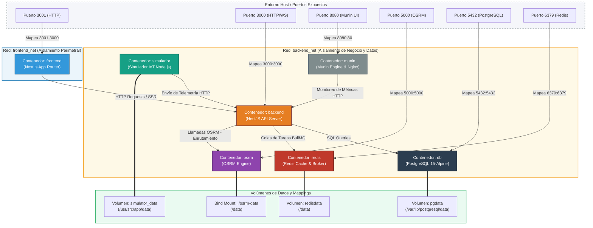

# Guía de Topología de Contenedores y Arquitectura de Microservicios

Este documento detalla la topología de contenedores, la segmentación de red y la arquitectura de infraestructura del sistema **Coldcase** (Monitoreo de Cadena de Frío e Inteligencia de Rutas). Está diseñado para servir como referencia técnica tanto para el desarrollo local con Docker Compose como para la administración del despliegue en clústeres Kubernetes de producción.

---

## 1. Diagrama de Topología de Red y Contenedores

La arquitectura implementa un **patrón de doble red aislada (DMZ Interna)**. Esto separa el tráfico expuesto a la red pública o cliente (Frontend/UI) del tráfico de procesamiento interno, persistencia y computación geográfica (Backend, BD, Redis, OSRM, Simulador y Munin).

<!-- 
OPCIÓN DE IMAGEN PERSONALIZADA:
Si prefieres diseñar tu propio diagrama en Figma, draw.io, Excalidraw o Miro y subir la imagen:
1. Exporta tu diseño como PNG o SVG y guárdalo en la ruta: 'infra/assets/arquitectura.png'
2. Reemplaza el bloque ```mermaid de abajo por la siguiente línea:


-->



---

## 2. Inventario de Contenedores y Especificaciones de Servicios

El sistema se compone de **7 contenedores activos** orquestados mediante Docker Compose. A continuación, se detalla la configuración y el propósito de cada servicio:

### 1. `frontend` (Next.js Application)
* **Imagen / Build**: Compilado local desde `./frontend` (Target: `development` para recarga en caliente).
* **Propósito**: Aplicación web SPA y SSR construida con Next.js (React / TailwindCSS / Leaflet / Vis.js). Ofrece el dashboard visual para el cliente.
* **Redes**: 
  * `frontend_net`
* **Puertos**: `3001:3000` (El host accede mediante http://localhost:3001).
* **Variables de Entorno Clave**:
  * `NEXT_PUBLIC_API_URL`: Dirección de la API del backend (`http://localhost:3000`).

### 2. `backend` (NestJS Core API)
* **Imagen / Build**: Compilado local desde `./backend` (Target: `development`).
* **Propósito**: API Gateway e inteligencias del sistema. Implementa JWT, orquestador de telemetría de sensores de temperatura, geocercas, colas BullMQ para llamadas a Large Language Models (Groq / Zep) y análisis de desvíos mediante OSRM.
* **Redes**: 
  * `frontend_net` (para atender al frontend).
  * `backend_net` (para interactuar con servicios internos).
* **Puertos**: `3000:3000` (El host accede mediante http://localhost:3000).
* **Dependencias**: Inicia después de `db` y `redis`.
* **Variables de Entorno Clave**:
  * `DATABASE_URL`: Conexión de Prisma a `db:5432`.
  * `REDIS_HOST` / `REDIS_PORT`: Conexión a Redis (`redis`, `6379`).
  * `OSRM_BASE_URL`: Conexión al motor de rutas (`http://osrm:5000`).

### 3. `db` (PostgreSQL Engine)
* **Imagen**: `postgres:15-alpine` (Huella de memoria optimizada).
* **Propósito**: Persistencia relacional de todas las entidades (Usuarios, Rutas, Puntos de Telemetría, Incidentes, Logs y Auditorías).
* **Redes**: 
  * `backend_net` (Completamente inaccesible desde el exterior excepto por puerto mapeado en desarrollo).
* **Puertos**: `5432:5432`.
* **Persistencia**: Volumen nombrado `pgdata` mapeado a `/var/lib/postgresql/data`.
* **Inicialización**: Mapea en modo lectura (`ro`) el script de estructura `./database/init.sql` al directorio de inicialización del contenedor `/docker-entrypoint-initdb.d/00-schema.sql`.

### 4. `redis` (Cache & BullMQ Broker)
* **Imagen**: `redis:alpine`.
* **Propósito**: Broker de almacenamiento en memoria intermedia y mensajería asíncrona. Soporta el motor de colas BullMQ del backend para procesar auditorías de incidentes de IA sin bloquear el hilo principal de Node.js.
* **Comando de Inicio**: `redis-server --appendonly yes` (Garantiza durabilidad de los trabajos en cola escribiendo en disco).
* **Redes**: 
  * `backend_net`.
* **Puertos**: `6379:6379`.
* **Persistencia**: Volumen nombrado `redisdata` mapeado a `/data`.

### 5. `osrm` (Open Source Routing Machine Engine)
* **Imagen / Build**: Compilado local desde `./osrm` (Basado en la imagen oficial del motor OSRM).
* **Propósito**: Motor geográfico de enrutamiento de alto rendimiento. Calcula rutas ideales, matrices de distancias y comprueba desviaciones analizando las coordenadas recibidas de los sensores.
* **Redes**: 
  * `backend_net`.
* **Puertos**: `5000:5000`.
* **Persistencia**: Bind mount local `./osrm-data` mapeado a `/data`.
* **Healthcheck**: Implementa un comando de prueba con `curl` que valida el enrutamiento interno enviando coordenadas simuladas en El Salvador. Si no responde en 5 intentos con intervalo de 10s, se marca como no saludable.

### 6. `simulador` (IoT Hardware Simulator)
* **Imagen / Build**: Compilado local desde `./simulador` (Target: `development`).
* **Propósito**: Simula el comportamiento físico de los camiones de reparto (desplazamiento real por carreteras salvadoreñas, fluctuaciones de temperatura por fallas en motor, apertura de puertas, y pérdida de señal celular).
* **Redes**: 
  * `backend_net` (Se comunica directamente con el backend mediante la red Docker sin requerir exposición externa al host).
* **Persistencia**: Volumen nombrado `simulator_data` mapeado a `/usr/src/app/data` para almacenar el archivo de estado persistente del simulador (`simulator_state.json`).
* **Variables de Entorno Clave**:
  * `API_URL`: Apunta directamente a `http://backend:3000` en la red privada de Docker.

### 7. `munin` (Munin Monitoring)
* **Imagen / Build**: Compilado local desde `./infra/munin` (Ubuntu 22.04 base).
* **Propósito**: Servidor de monitorización centralizado y visor de rendimiento de recursos en tiempo real mediante gráficas HTML generadas de forma automática.
* **Características Clave**:
  * Integra Nginx interno para servir el panel visual.
  * Inyecta un script/sensor personalizado (`nestjs_app`) en `/etc/munin/plugins/` que realiza consultas curl al endpoint privado del backend (`http://backend:3000/munin/metrics`) para graficar la memoria heap, RSS, memoria total y tiempo activo (uptime) de la API.
* **Redes**: 
  * `backend_net`.
* **Puertos**: `8080:80` (Mapea la interfaz web de Munin en el puerto host 8080).

---

## 3. Aislamiento y Políticas de Seguridad en Redes

La configuración de redes en este proyecto simula un entorno real de nube (AWS VPC, Azure VNet) mediante el uso de redes virtuales con el driver `bridge` de Docker:

| Red | Driver | Nivel de Confianza | Contenedores Miembros | Razón de Aislamiento |
| :--- | :--- | :--- | :--- | :--- |
| **`frontend_net`** | `bridge` | Medio (Externa) | `frontend`, `backend` | Expone la capa visual al usuario final. Ningún contenedor de base de datos o enrutamiento geográfico vive aquí para prevenir ataques de escalamiento o inyecciones directas desde el exterior. |
| **`backend_net`** | `bridge` | Alto (Interna) | `backend`, `db`, `redis`, `osrm`, `simulador`, `munin` | Concentra la lógica de negocio, almacenamiento persistente e infraestructura crítica. El simulador, Munin, Redis y PostgreSQL conversan de forma aislada y segura. |

### Flujo DMZ (Demilitarized Zone)
1. El usuario final se conecta al **`frontend`** (puerto 3001).
2. El frontend realiza llamadas al **`backend`** a través de la red compartida `frontend_net`.
3. El **`backend`** procesa la solicitud, y para completarla, realiza consultas internas a la base de datos PostgreSQL, al broker de Redis o al motor OSRM, todo a través de la red interna privada `backend_net`.
4. Si un atacante comprometiera el contenedor de `frontend`, **no tendría ruta física ni visibilidad de red hacia la base de datos PostgreSQL, Redis o el motor OSRM**, ya que no comparte la red `backend_net`. El único contenedor con doble interfaz de red es el `backend`, actuando como el guardián de la seguridad de la infraestructura.

---

## 4. Flujo de Datos en Tiempo Real y Ciclo de Vida de los Datos

El flujo de información para los incidentes y telemetría sigue una ruta estrictamente controlada entre los contenedores:

```
[Simulador IoT] --(Envía Telemetría / HTTP POST)--> [Backend API (NestJS)]
                                                            │
                     ┌──────────────────────────────────────┴──────────────────────────────────────┐
                     ▼ (Escribe Evento Rápido)                                                     ▼ (Envia a procesar)
             [PostgreSQL (db)]                                                              [Redis / BullMQ Queue]
                     │                                                                             │
                     ▼ (Lectura en Dashboard)                                                      ▼ (Procesamiento Asíncrono)
             [Frontend (Next.js)] <---(HTTP GET)-------------------------------------------- [Auditor IA Worker]
                                                                                                   │
                                                                                                   ▼ (Llama a Groq/Zep Cloud)
                                                                                            [Servicios Externos de IA]
```

### Proceso de Telemetría e Incidentes
1. **Generación**: El `simulador` calcula cada segundo la posición física y temperatura del transporte y la transmite vía HTTP POST a `backend:3000/telemetria`.
2. **Procesamiento de Rutas**: El `backend` consulta a `osrm:5000` con la geolocalización actual para calcular si el transporte se ha desviado de su ruta planificada.
3. **Persistencia de Telemetría**: El `backend` almacena el registro en PostgreSQL (`db:5432`).
4. **Disparo de Incidentes**: Si la temperatura supera el umbral crítico de la cadena de frío o se detecta un desvío geográfico, se crea un incidente en la base de datos.
5. **Procesamiento de IA Diferido**: Para no congelar el servidor de telemetría mientras se espera la generación de resúmenes o análisis semánticos complejos por inteligencia artificial, el `backend` inserta un trabajo en la cola de BullMQ gestionada por `redis:6379`.
6. **Ejecución del Worker**: Un proceso asíncrono (worker) en el `backend` consume la cola de Redis, interactúa con **Zep Cloud** (memoria e historial) y **Groq** (para generar la auditoría de incidencias), y actualiza el incidente en PostgreSQL con el veredicto analítico.
7. **Visualización**: El `frontend` actualiza en tiempo real los mapas y las gráficas del dashboard consultando los endpoints de telemetría e incidentes del `backend`.

---

## 5. Mapeo de Docker Compose a Manifiestos de Kubernetes

Para el despliegue en producción (`infra/k8s/`), la topología de Docker Compose se traduce directamente a objetos nativos de Kubernetes para asegurar alta disponibilidad, escalabilidad horizontal y balanceo de carga automático:

| Recurso en Docker Compose | Componente de Kubernetes (`infra/k8s/`) | Tipo de Recurso | Detalle de Producción |
| :--- | :--- | :--- | :--- |
| **`db`** | `postgres.yaml` | `StatefulSet` + `PersistentVolumeClaim` | Garantiza identidad de red persistente para almacenamiento seguro de la base de datos. |
| **`redis`** | `redis.yaml` | `Deployment` + `Service` | Broker de mensajería interno, aislado de accesos externos. |
| **`osrm`** | `osrm.yaml` | `Deployment` + `PersistentVolumeClaim` | Escala horizontalmente para responder múltiples peticiones de enrutamiento simultáneas. |
| **`backend`** | `backend.yaml` | `Deployment` + `HorizontalPodAutoscaler` | API Server. Escala en base a CPU/Memoria bajo demanda. |
| **`frontend`** | `frontend.yaml` | `Deployment` + `Service` | Servidor SSR Next.js expuesto de forma segura tras el Ingress Controller. |
| **`simulador`** | `simulador.yaml` | `Deployment` | Corre de forma continua como un servicio background dentro del clúster. |
| **`frontend_net` / `backend_net`** | `network-policy.yaml` | `NetworkPolicy` | Reglas estrictas a nivel de CNI (Calico/Flannel) que impiden a los pods de la interfaz web acceder a los pods de la base de datos. |
| **Puertos Host Mapeados** | `ingress.yaml` | `Ingress` + `Cert-Manager` (SSL) | Nginx Ingress Controller que expone externamente la app en el subdominio configurado mediante HTTPS automático. |
